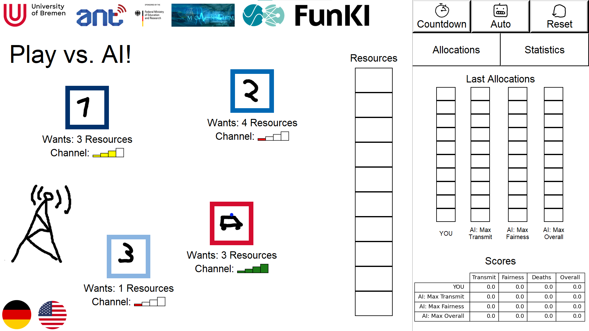

# Man vs Machine Resource Scheduling demo

The user can compare themselves to three AI algorithms in optimizing system metrics,
currently sum rate, fairness, ambulance timeouts, and mixed performance, by intelligent resource scheduling.
There is also a countdown challenge mode.

The relevant file to start the GUI demo is `src/analysis/gui.py`



### How does it work?
- Users want x number of resources -> allocating more than that has no benefit
- Users have a channel strength -> One resource at better channel leads to more "throughput"
- Click on user icon to allocate one resource to this user
- When all resources are allocated, stats are calculated:
  - Throughput (roughly resources times channel strength)
  - Fairness (proportional)
  - Deaths (did ambulance get all required resources)
  - Overall (weighted sum of all other stats)
- Three AI schedulers are implemented for comparison: one tries to maximize throughput, one fairness, one overall. Their results are shown in the center table
- The lower graph compares all scheduler's average results on the overall metric since starting the demo.


### Talking points:
- What is optimization criterion? Data Throughput? Fairness (How do we define that?)?
Special Objectives, e.g., ambulance traffic? Usually a mixed objective, depending on operator,
area (urban, non-urban, ...) -> Complex
- How does the Reinforcement Learned algorithm learn the relative importance of these factors? -> 
Trial and error, just like the player would when playing the demo
- You will notice: AI Algorithms are not trained to convergence, i.e., Max Fairness will not always find
the fairest allocation etc. This is not immediately obvious -> we must be mindful of that when applying AI
algorithms in practice

### Folder Structure:

```
|   .gitignore          | .gitignore
|   README.md           | this file
|   requirements.txt    | project dependencies
|           
+---models              | pre-trained models
+---reports             | related material
+---src                 | code
|   +---analysis        |   GUI related
|   +---config          |   configuration files
|   +---data            |   simulation related
|   +---models          |   learning related
```
